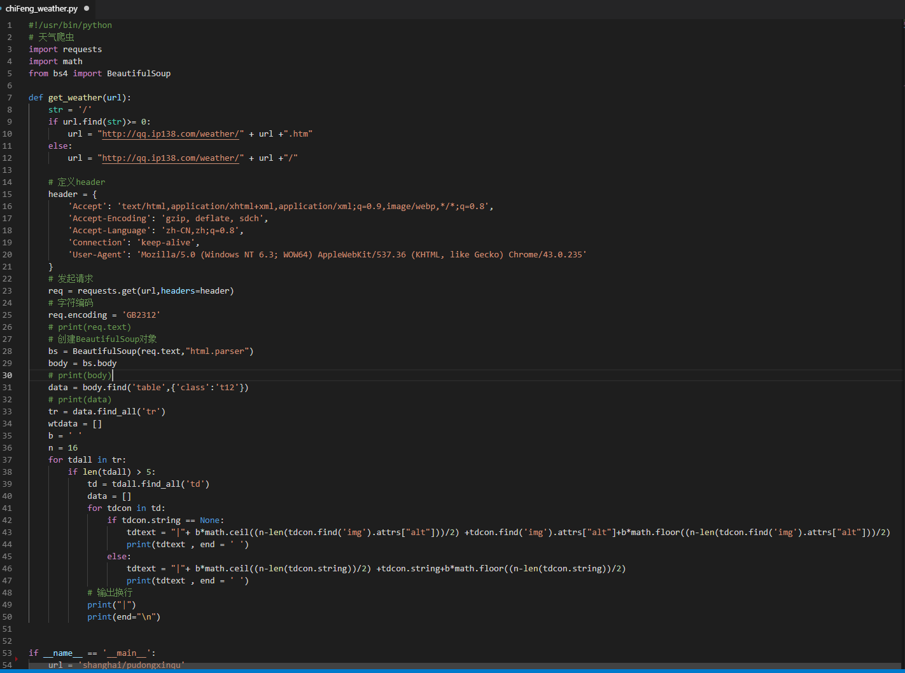
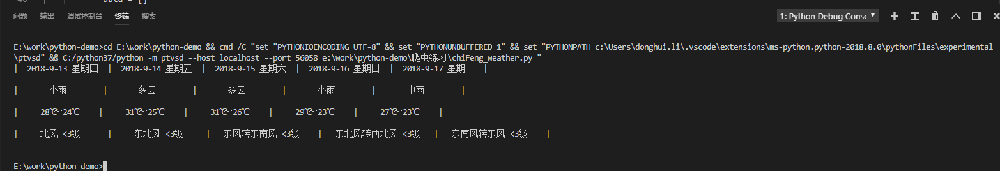

# python天气爬虫

#### 项目介绍
Python编写的天气爬虫，获取未来五天天气情况，数据来源www.ip138.com/
  




#### 参数说明

``` bash

if __name__ == '__main__':
    url = 'shanghai/pudongxinqu'
    get_weather(url)

    # 地址取url
    # 内蒙古赤峰    neimenggu/ChiFeng
    # 上海长宁      shanghai/changning
    # 上海宝山      shanghai/Baoshan
    # 上海浦东      shanghai/pudongxinqu

    
```

#### 说明

>  数据来源www.ip138.com

>  如果对您有帮助，您可以点右上角 "Star" 支持一下 谢谢！ ^_^

>  或者您可以 "follow" 一下，我会不断开源更多的有趣的项目

>  开发环境 w7  Chrome 61 vscode

>  如有问题请直接在 Issues 中提，或者您发现问题并有非常好的解决方案，欢迎 PR 👍